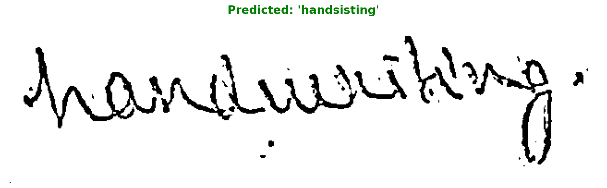

# Handwriting OCR: Word-by-Word Text Generation

A complete handwriting OCR system using CNN + LSTM + CTC architecture for paragraph-level recognition. Trained on the IAM Handwriting Database with word-by-word text generation capabilities.



## Features

- **CNN + LSTM + CTC Architecture** - Industry-standard OCR model
- **Word-by-Word Generation** - Natural text prediction with proper spacing
- **Paragraph-Level Recognition** - Process multiple lines and full paragraphs
- **Real Dataset Training** - Uses IAM Handwriting Database (38k+ samples)
- **Corrupted Image Handling** - Robust error handling for bad images
- **Character Error Rate (CER)** - Comprehensive evaluation metrics

## Model Architecture

```
Input Image (32x128)
    ↓
CNN Feature Extractor (5 blocks)
    ↓
Bidirectional LSTM (2 layers, 256 hidden)
    ↓
Fully Connected Layer
    ↓
CTC Decoder
    ↓
Predicted Text
```

**Model Specs:**
- Parameters: 6.4M
- Input: Grayscale images (32h × 128w pixels)
- Output: Variable-length text sequences
- Vocabulary: 78 characters (letters, digits, punctuation)

## Quick Start

### 1. Install Dependencies

```bash
pip install torch torchvision numpy matplotlib pillow opencv-python tqdm scikit-learn
```

### 2. Prepare Dataset

Download the IAM Handwriting Database:
```bash
# Place the dataset in the following structure:
iam_dataset/
├── iam_words/
│   └── words/
│       ├── a01/
│       ├── a02/
│       └── ...
└── words_new.txt
```

### 3. Train the Model

Open and run the notebook:
```bash
jupyter notebook handwriting_ocr_iam.ipynb
```

Or use the command line:
```bash
python train_ocr.py
```

### 4. Inference

```python
from PIL import Image
import torch

# Load trained model
checkpoint = torch.load('best_handwriting_ocr.pth')
model.load_state_dict(checkpoint['model_state_dict'])
char_to_idx = checkpoint['char_to_idx']
idx_to_char = checkpoint['idx_to_char']

# Predict text from image
text = predict_text(model, 'path/to/handwriting.png',
                   char_to_idx, idx_to_char, device)
print(f"Recognized: {text}")
```

## Files Overview

### Main Notebooks
- **`handwriting_ocr_iam.ipynb`** - Complete training pipeline with IAM dataset
- **`handwriting_recognition_trocr.ipynb`** - TrOCR baseline comparison

### Scripts
- **`fix_corrupted_images.py`** - Utility to handle corrupted images in dataset
- **`test_custom_handwriting.py`** - Test trained model on custom images

### Model Files
- **`best_handwriting_ocr.pth`** - Best trained model checkpoint (saved during training)

## Training Results

**Expected Performance:**
- After 10 epochs: CER ~30-40%
- After 30 epochs: CER ~15-25%
- After 50-100 epochs: CER ~5-15%

**Training Configuration:**
```python
BATCH_SIZE = 64
LEARNING_RATE = 0.001
NUM_EPOCHS = 30
OPTIMIZER = Adam
SCHEDULER = ReduceLROnPlateau
```

## How It Works

### 1. **Data Processing**
- Images are resized to 32×128 pixels (maintaining aspect ratio)
- Normalized to [0, 1] range
- Augmented with Gaussian noise during training

### 2. **Feature Extraction (CNN)**
- 5 convolutional blocks with batch normalization
- Preserves horizontal sequence (width dimension)
- Reduces height through pooling (32 → 2 pixels)

### 3. **Sequence Modeling (LSTM)**
- Bidirectional LSTM processes features left-to-right and right-to-left
- Captures context from both directions
- 2 layers with 256 hidden units each

### 4. **CTC Decoding**
- Connectionist Temporal Classification handles alignment
- No need for character-level annotations
- Automatically learns spacing between words

### 5. **Word-by-Word Generation**
- Model predicts characters sequentially
- Space character is predicted naturally
- Words emerge from character predictions

## Example Usage

### Single Line Recognition
```python
# Recognize a single line of handwriting
text = predict_text(model, 'handwriting_line.png',
                   char_to_idx, idx_to_char, device)
# Output: "Hello world this is a test"
```

### Paragraph Recognition
```python
# Process multiple lines into a paragraph
line_paths = ['line1.png', 'line2.png', 'line3.png']
paragraph = recognize_paragraph(model, line_paths,
                               char_to_idx, idx_to_char, device)
# Output:
# "This is line one
# This is line two
# This is line three"
```

## Dataset: IAM Handwriting Database

- **Size**: 38,305 word images
- **Writers**: 657 different writers
- **Format**: Grayscale PNG images
- **Annotations**: Word-level transcriptions
- **Split**: 90% train / 10% validation

## Advanced Features

### Beam Search Decoding
```python
# More accurate than greedy decoding
pred_text = beam_search_decode(logits, idx_to_char, beam_width=10)
```

### Custom Vocabulary
```python
# Build vocabulary from your own dataset
vocab, char_to_idx, idx_to_char = build_vocabulary(annotations)
```

### Data Augmentation
```python
# Automatic augmentation during training
- Gaussian noise (σ=0.02)
- Maintains aspect ratio during resize
- Random padding/cropping
```

## Troubleshooting

### Corrupted Images Error
If you encounter `UnidentifiedImageError`:
```python
# The dataset class automatically handles this
# Corrupted images are skipped with a warning
⚠️  Skipping corrupted image at idx 1234
```

### Out of Memory
Reduce batch size:
```python
BATCH_SIZE = 32  # or 16
```

### Low Accuracy
- Train for more epochs (50-100)
- Increase model size (hidden_size=512)
- Add more data augmentation
- Use beam search decoding

## Model Improvements

### Next Steps:
1. **Attention Mechanism** - Better image-text alignment
2. **Transformer Encoder** - Replace CNN with Vision Transformer
3. **Language Model** - Post-process with spell checking
4. **Line-level Training** - Use full line images (not just words)
5. **Transfer Learning** - Fine-tune on your custom handwriting

## Citation

If you use this code, please cite:

```bibtex
@misc{handwriting-ocr-2025,
  title={Handwriting OCR: Word-by-Word Text Generation},
  author={OCR Developer},
  year={2025},
  howpublished={\url{https://github.com/yourusername/handwriting-ocr}}
}
```

**IAM Handwriting Database:**
```bibtex
@article{marti2002iam,
  title={The IAM-database: an English sentence database for offline handwriting recognition},
  author={Marti, U-V and Bunke, Horst},
  journal={International Journal on Document Analysis and Recognition},
  volume={5},
  number={1},
  pages={39--46},
  year={2002},
  publisher={Springer}
}
```

## License

MIT License - see LICENSE file for details

## Acknowledgments

- IAM Handwriting Database for providing the dataset
- PyTorch team for the deep learning framework
- Research community for CTC loss and OCR architectures

## Contact

For questions or issues, please open a GitHub issue or contact:
- Email: your.email@example.com
- GitHub: [@yourusername](https://github.com/yourusername)

---

**Built with ❤️ for handwriting recognition research**
